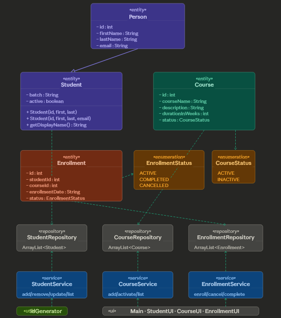

# LearnTrack — Student & Course Management System

## Project Description

**LearnTrack** is a menu-driven, console-based Java application built to manage students, courses, and enrollments for a training institute. The project is developed in **Java 17** and demonstrates core Object-Oriented Programming principles including encapsulation, inheritance, polymorphism, and exception handling — all through clean, well-structured code.

The system allows staff to add and manage students and courses, enroll students into courses, and track enrollment status — entirely in-memory via a live console interface.

---



## Package Structure

```
src/
└── com/
    └── airtribe/
        │
        ├── constant/
        │   ├── AppConstants.java        # App-wide constant values
        │   └── MenuOptions.java         # Menu option constants
        │
        ├── docs/
        │   ├── JVM_Basics.md
        │   └── Setup_Instructions.md
        │
        ├── entity/
        │   ├── Person.java              # Base class: id, firstName, lastName, email
        │   ├── Student.java             # Extends Person; adds batch, active
        │   ├── Course.java              # courseName, description, durationInWeeks, status
        │   └── Enrollment.java          # studentId, courseId, enrollmentDate, status
        │
        ├── enums/
        │   ├── CourseStatus.java        # ACTIVE, INACTIVE
        │   └── EnrollmentStatus.java    # ACTIVE, COMPLETED, CANCELLED
        │
        ├── exception/
        │   ├── EmptyListException.java
        │   ├── EntityNotFoundException.java
        │   └── InvalidInputException.java
        │
        ├── learntrack/                  # UI layer
        │   ├── CourseUI.java            # Course menu & input handling
        │   ├── EnrollmentUI.java        # Enrollment menu & input handling
        │   ├── StudentUI.java           # Student menu & input handling
        │   └── Main.java               # Entry point — launches main menu
        │
        ├── repository/
        │   ├── CourseRepository.java    # In-memory ArrayList store for courses
        │   ├── EnrollmentRepository.java
        │   └── StudentRepository.java
        │
        ├── service/
        │   ├── CourseService.java       # Business logic for courses
        │   ├── EnrollmentService.java   # Business logic for enrollments
        │   └── StudentService.java      # Business logic for students
        │
        └── util/
            ├── IdGenerator.java         # Static ID counters per entity
            └── InputValidator.java      # Input validation helpers
```

---

## Key Features

### Student Management
- Add a new student (with or without email — constructor overloading)
- View all registered students
- Search student by ID
- Deactivate a student (soft delete — sets `active = false`)

### Course Management
- Add a new course
- View all available courses
- Activate or deactivate a course (`CourseStatus` enum)

### Enrollment Management
- Enroll a student into a course
- View all enrollments for a specific student
- Mark an enrollment as `COMPLETED` or `CANCELLED` (`EnrollmentStatus` enum)

---

## OOP Concepts Demonstrated

| Concept                     | Where |
|-----------------------------|------------------------------------------------------------
| **Encapsulation**           | Private fields + getters/setters in all entity classes |
| **Inheritance**             | `Student` extends `Person` |
| **Polymorphism**            | `getDisplayName()` overridden in `Student` |
| **Constructor Overloading** | `Student` — two constructors (with/without email) |
| **Static members**          | `IdGenerator` uses static counters + static methods |
| **Enums**                   | `CourseStatus`, `EnrollmentStatus` in `enums` package |
| **Custom Exceptions**       | `EntityNotFoundException`, `InvalidInputException`, `EmptyListException` |
| **Constants**               | `AppConstants`, `MenuOptions` in `constant` package |
| **Repository layer**        | `StudentRepository`, `CourseRepository`, `EnrollmentRepository` hold `ArrayList` data
| **Service layer**           | Business logic cleanly separated from UI |

---

## Architecture Overview

```
Main.java
   │
   ├── StudentUI    ──►  StudentService    ──►  StudentRepository    (ArrayList<Student>)
   ├── CourseUI     ──►  CourseService     ──►  CourseRepository     (ArrayList<Course>)
   └── EnrollmentUI ──►  EnrollmentService ──►  EnrollmentRepository (ArrayList<Enrollment>)
                                │
                           IdGenerator    (util)
                           InputValidator (util)
                           Custom Exceptions (exception)
```

---

## How to Compile and Run

### Prerequisites

- Java 17 installed — verify with:

```bash
java -version
javac -version
```

### Step 1 — Clone or Download the Project

```bash
https://github.com/AjTransformer/LearnTrack.git
cd learntrack
```

### Step 2 — Compile All Source Files

From the **project root** (the folder containing `src/`):

```bash
javac -d out $(find src -name "*.java")
```

> **Windows CMD alternative** (compile package by package in dependency order):
> ```bash
> javac -d out src/com/airtribe/constant/*.java src/com/airtribe/enums/*.java src/com/airtribe/exception/*.java src/com/airtribe/entity/*.java src/com/airtribe/util/*.java src/com/airtribe/repository/*.java src/com/airtribe/service/*.java src/com/airtribe/learntrack/*.java
> ```

This places all `.class` files under `out/`, preserving the package structure.

### Step 3 — Run the Application

```bash
java -cp out com.airtribe.learntrack.Main
```

You should see:

```
===== LearnTrack =====
1. Student Management
2. Course Management
3. Enrollment Management
0. Exit
Enter choice:
```

---

## Project Structure on Disk

```
learntrack/
├── src/
│   └── com/airtribe/
│       ├── constant/
│       ├── docs/
│       ├── entity/
│       ├── enums/
│       ├── exception/
│       ├── learntrack/      ← UI layer + Main entry point
│       ├── repository/
│       ├── service/
│       └── util/
├── out/                     ← compiled .class files (auto-generated)
└── README.md
```

---

## Data Storage

All data is stored **in-memory** using `ArrayList` inside the repository classes. No database or file I/O is used. Data resets each time the application is restarted.

---

## Error Handling

| Scenario | Exception | Handling |
|----------|-----------|---------|
| Student/Course not found | `EntityNotFoundException` | Caught in UI layer, prints a friendly message |
| Invalid menu choice or bad format | `InvalidInputException` | Caught around `Integer.parseInt()` calls |
| Viewing an empty list | `EmptyListException` | Caught in UI layer, prints "No records found" |

The program never crashes on bad input — all exceptions are caught at the UI layer and shown as clean console messages.

---

## Java Version

```
Java SE 17.0.15 (LTS)
```
